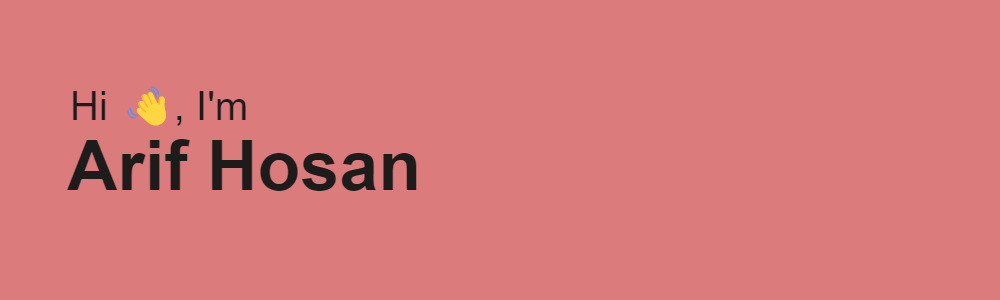

<!--  -->



<p align="left">
  <a href="https://leetcode.com/arifhosan/">
    
  </a>
  <a href="https://codeforces.com/profile/ArifHosan">
    
  </a>
  <a href="https://stackoverflow.com/users/5510537/arif-hosan">
    
  </a>
  <a href="https://github.com/ArifHosan?tab=followers">
    
  </a>
  <a href="https://github.com/ArifHosan/">
    
  </a>
</p>

- Programmer and Full-stack Developer
- Living in Aachen, Germany
- From Dhaka, Bangladesh

<a href="https://www.buymeacoffee.com/arifhosan" target="_blank"></a>

### :hourglass: Current Work
- Research Associate
- Cybernetics Lab, IMA, RWTH Aachen University
- Aachen, Germany


### :computer: Coding Stats (Tracked)
<!--START_SECTION:waka-->

```txt
Total Time: 717 hrs 35 mins

Python                     207 hrs 59 mins ███████▒░░░░░░░░░░░░░░░░░   28.68 %
JavaScript                 199 hrs 29 mins ███████░░░░░░░░░░░░░░░░░░   27.51 %
TypeScript                 71 hrs 38 mins  ██▒░░░░░░░░░░░░░░░░░░░░░░   09.88 %
TeX                        39 hrs 27 mins  █▒░░░░░░░░░░░░░░░░░░░░░░░   05.44 %
Java                       36 hrs          █▒░░░░░░░░░░░░░░░░░░░░░░░   04.97 %
HTML                       31 hrs 48 mins  █░░░░░░░░░░░░░░░░░░░░░░░░   04.39 %
JSON                       23 hrs 36 mins  ▓░░░░░░░░░░░░░░░░░░░░░░░░   03.26 %
PHP                        17 hrs 20 mins  ▓░░░░░░░░░░░░░░░░░░░░░░░░   02.39 %
YAML                       14 hrs 46 mins  ▓░░░░░░░░░░░░░░░░░░░░░░░░   02.04 %
Docker                     12 hrs 1 min    ▒░░░░░░░░░░░░░░░░░░░░░░░░   01.66 %
```

<!--END_SECTION:waka-->

### ⚡ Github Stats
<p float="left">
 

</p>

### &#128200; Competitive Programming

<p>


<!--  -->
<!--  -->
</p>

<!--
**ArifHosan/ArifHosan** is a ✨ _special_ ✨ repository because its `README.md` (this file) appears on your GitHub profile.

Here are some ideas to get you started:

- 🔭 I’m currently working on ...
- 🌱 I’m currently learning ...
- 👯 I’m looking to collaborate on ...
- 🤔 I’m looking for help with ...
- 💬 Ask me about ...
- 📫 How to reach me: ...
- 😄 Pronouns: ...
- ⚡ Fun fact: ...
-->
